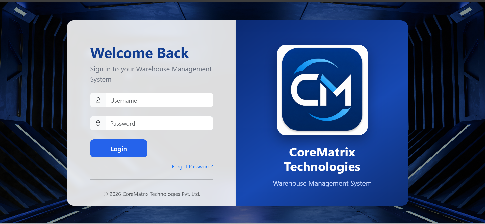
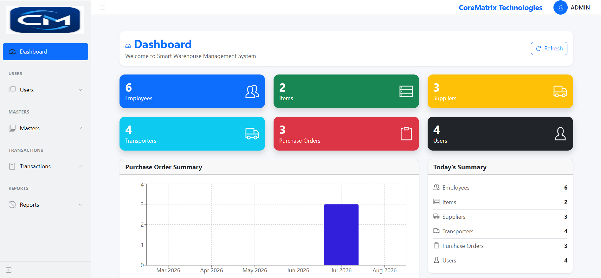
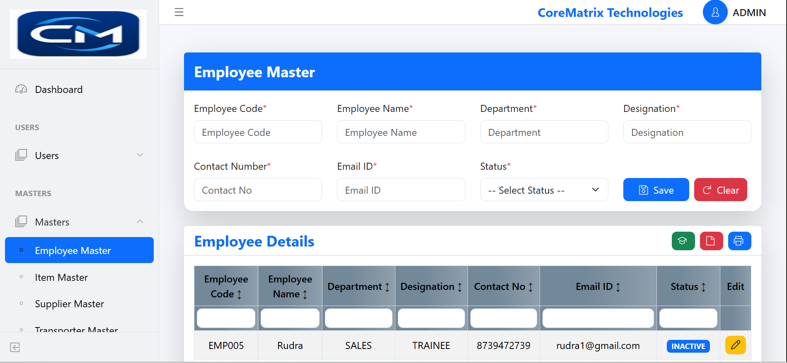
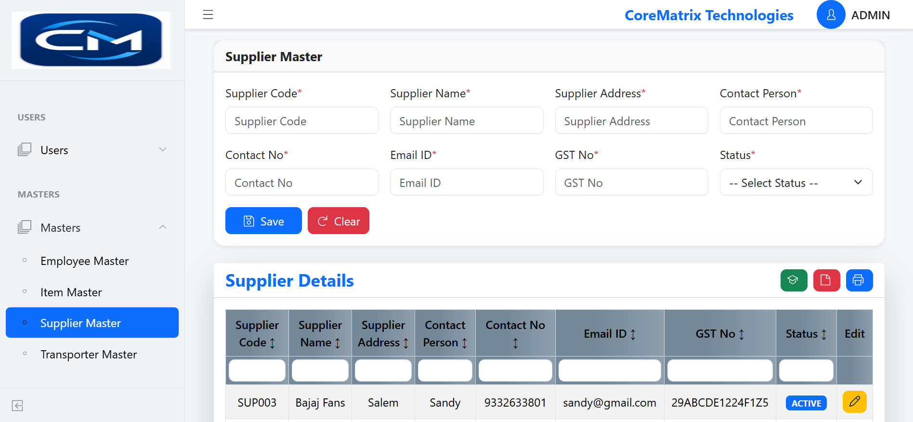
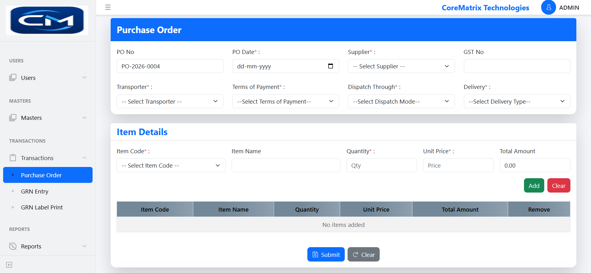
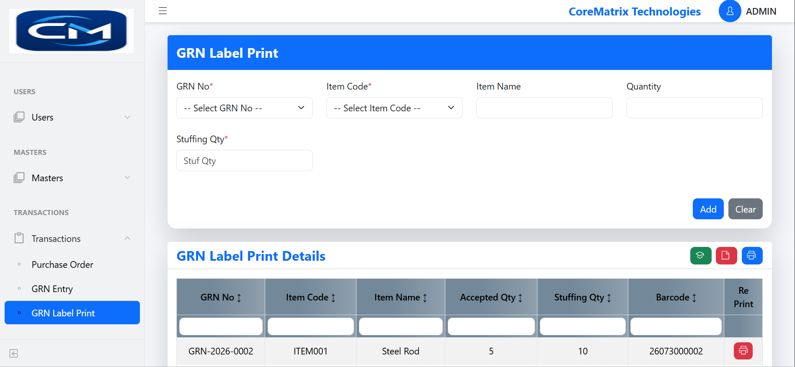
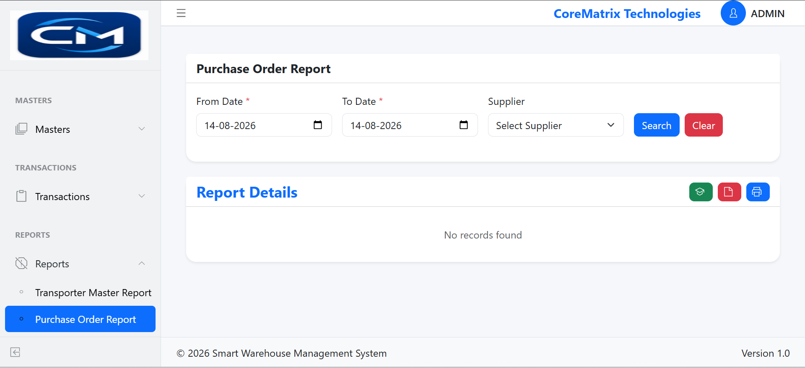
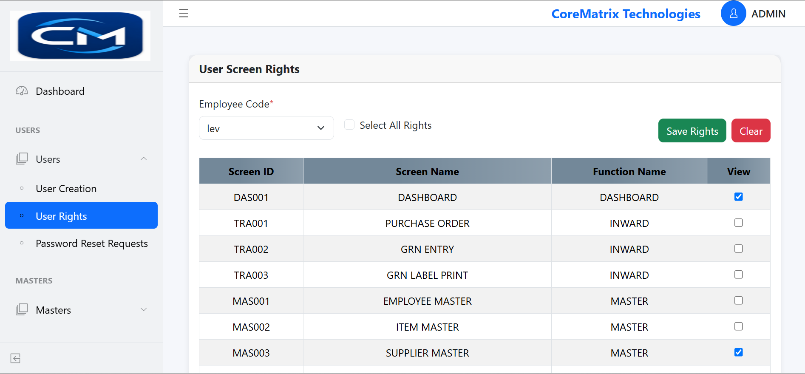

# 📦 CoreMatrix Warehouse Management System

A full-stack Warehouse Management System designed to manage warehouse operations, inventory, purchasing, suppliers, transporters, users, and screen-level authorization.

---

## 🚀 Overview

CoreMatrix Warehouse Management System is a full-stack web application developed using React.js, ASP.NET Core Web API, and Microsoft SQL Server.

The system provides centralized warehouse management with:

- JWT authentication
- User and screen-level authorization
- Dashboard analytics
- Master data management
- Purchase order processing
- GRN processing
- Label printing
- Reporting and exports
- Data validation

---

## 🌐 Live Demo

🚀 **Live Application:**  
[CoreMatrix Warehouse Management System](https://corematrixfrontend.runasp.net/)


---

## 🏢 Project

**CoreMatrix Technologies**

---

# ✨ Features

## 🔐 Authentication

- Secure Login
- JWT Authentication
- Protected APIs
- Session Management
- Logout

## 📊 Dashboard

- Employee Count
- Item Count
- Supplier Count
- Purchase Order Count
- Today's Summary
- Purchase Order Statistics
- Recent Purchase Orders

## 📁 Master Modules

- Employee Master
- User Master
- Supplier Master
- Item Master
- Transporter Master

## 📦 Transaction Modules

- Purchase Order Entry
- Goods Receipt (GRN)
- Label Printing
- Purchase Order Report

## 👥 User Management

- User Rights Management
- Screen-Level Authorization
- Dynamic Sidebar Menu
- Role-Based Screen Access

## 📄 Reports

- Purchase Order Report
- Excel Export
- PDF Export
- Search
- Pagination
- Filters

## ✅ Validation

- Required Field Validation
- Duplicate Validation
- Excel Validation
- Success/Error Messages

---

# 🛠 Technology Stack

## Frontend

- React.js
- CoreUI
- Axios
- React Router
- Bootstrap

## Backend

- ASP.NET Core Web API (.NET 8)
- C#
- ADO.NET
- REST API
- JWT Authentication

## Database

- Microsoft SQL Server
- Stored Procedures
- Views
- Transactions

---

# 🏗 Project Architecture

```text
React.js Frontend
        │
        │ Axios
        ▼
ASP.NET Core Web API
        │
        │ ADO.NET
        ▼
SQL Server
        │
        ▼
Stored Procedures
```

---

# 📂 Project Structure

```
CoreMatrix-Warehouse-Management-System
│
├── Frontend
│   ├── Components
│   ├── Services
│   ├── Layout
│   ├── Routes
│   ├── Assets
│   ├── Context
│   └── Utils
│
├── Backend
│   └── SmartWarehouse.API
│       ├── Controllers
│       ├── Models
│       ├── Helpers
│       ├── Data
│       ├── Middleware
│       └── Program.cs
│
├── Database
│   ├── Tables
│   ├── Stored Procedures
│   ├── Views
│   └── Scripts
│
├── Screenshots
│
└── README.md
```

---

# 🔐 Authentication Flow

```
User Login
     │
     ▼
Login API
     │
     ▼
Verify Username & Password
     │
     ▼
Generate JWT Token
     │
     ▼
Store JWT Token
     │
     ▼
Access Protected APIs
```

---

# 👥 User Rights Flow

```
Administrator
     │
     ▼
Assign Screen Rights
     │
     ▼
USERAUTHENTICATION
     │
     ▼
User Login
     │
     ▼
Fetch User Rights
     │
     ▼
Generate Sidebar
     │
     ▼
Display Authorized Screens
```

---

# 📊 Dashboard

The dashboard displays real-time warehouse statistics including:

- Employees
- Items
- Suppliers
- Purchase Orders
- Dashboard Summary
- Purchase Order Statistics
- Recent Purchase Orders

---

# 🔒 Security Features

- JWT Authentication
- Protected Controllers
- Token Validation
- Dynamic User Rights
- Secure API Communication
- Role-Based Access Control

---

# 🗄 Database Tables

- EMPLOYEE
- USERMASTER
- SUPPLIER
- ITEMMASTER
- TRANSPORTER
- PURCHASEORDER
- PURCHASEORDERDETAILS
- USERAUTHENTICATION
- SCREENDETAILS

---

# 🌐 API Endpoints

## Login

```
POST

/api/Login/Login
```

---

## Dashboard

```
GET

/api/Dashboard/DashboardPageLoad
```

---

## Employee

```
GET
POST
PUT
DELETE
```

---

## Supplier

```
GET
POST
PUT
DELETE
```

---

## Item

```
GET
POST
PUT
DELETE
```

---

## Purchase Order

- Create Purchase Order
- Purchase Order Report
- Export Excel
- Export PDF

---

# 📸 Application Screenshots

### 🔐 Login



### 📊 Dashboard



### 👨‍💼 Employee Master



### 🏢 Supplier Master



### 📦 Purchase Order



### 🚚 GRN & Label Printing



### 📋 Purchase Order Report



### 🔐 User Rights



---

# ⚙ Installation

## Clone Repository

```bash
git clone https://github.com/VickyCoder21/CoreMatrix-Warehouse-Management-System.git
```

---

## Frontend

```bash
cd Frontend

npm install

npm run dev
```

---

## Backend

Open the ASP.NET Core Web API project in Visual Studio.

Run the ASP.NET Core Web API project.

---

## Database

- Restore SQL Server Database
- Execute Tables
- Execute Stored Procedures
- Update Connection String
- Run Application

---

# 🚀 Future Enhancements

- Barcode Scanner
- QR Code Tracking
- Email Notifications
- Notification Center
- Warehouse Analytics
- Audit Logs
- Stock Alerts
- Mobile Responsive App
- Multi-Warehouse Support
- Azure Cloud Deployment
- Docker Deployment

---

# 👨‍💻 Author

**Vignesh P**

.NET Full Stack Developer

Chennai, Tamil Nadu, India

---

# 📜 License

This project is shared for portfolio and demonstration purposes.

© 2026 CoreMatrix Technologies. All Rights Reserved.